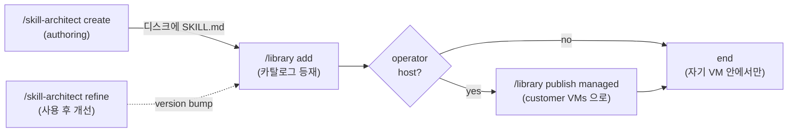

# The Library — Skill Catalog & Distribution

Catalog of skills (and agents/prompts) in `library.yaml`, distribution engine via `deploy-profile.sh`, GitHub backup/sync, customer-VM publish.

**Companion of `/skill-architect`**:
- Authoring + refinement → `/skill-architect`
- Catalog + distribution → `/library` (this)

## How It Works

`library.yaml` is a catalog of references to your skills/agents/prompts. Entries define what's *available* — not what gets installed. You pull on demand with `/library use <name>` or push out with `/library publish <profile>`.

- **`LIBRARY_REPO_URL`**: `<your forked repo url>` (set after `/library install`)
- **`LIBRARY_YAML_PATH`**: `~/.claude/skills/library/library.yaml`
- **`LIBRARY_SKILL_DIR`**: `~/.claude/skills/library/`

## Commands

### Catalog management (모든 호스트)

| Command                     | Cookbook | Purpose                                           |
| --------------------------- | -------- | ------------------------------------------------- |
| `/library add <details>`    | [add.md](cookbook/add.md) | 디스크에 있는 스킬을 카탈로그에 등록 (skill-architect create 의 마지막 단계) |
| `/library remove <name>`    | [remove.md](cookbook/remove.md) | 카탈로그에서 제거 (옵션: 디스크도) |
| `/library list`             | [list.md](cookbook/list.md) | 전체 카탈로그 + 설치 상태 |
| `/library search <keyword>` | [search.md](cookbook/search.md) | 키워드로 항목 찾기 |

### External source sync (GitHub)

| Command                  | Cookbook | Purpose                                |
| ------------------------ | -------- | -------------------------------------- |
| `/library install`       | [install.md](cookbook/install.md) | 첫 device setup: fork, clone, configure |
| `/library use <name>`    | [use.md](cookbook/use.md) | 외부 source 에서 pull (install or refresh) |
| `/library push <name>`   | [push.md](cookbook/push.md) | 로컬 변경 → upstream GitHub 백업 |
| `/library sync`          | [sync.md](cookbook/sync.md) | 모든 설치 항목 refresh |

### Customer-VM distribution (operator host only)

| Command                                  | Cookbook | Purpose                                                              |
| ---------------------------------------- | -------- | -------------------------------------------------------------------- |
| `/library publish <profile\|customer>`   | [publish.md](cookbook/publish.md) | managed customer VMs 으로 rsync (`deploy-profile.sh` 위임). customers 레지스트리 필요 → operator host 에서만 작동 |

**Cookbook 항상 먼저** — `/library <명령>` 실행 시 해당 cookbook 파일 읽고 단계대로 진행.

## Lifecycle Handoff (`/skill-architect` 와의 경계)



`/skill-architect` 가 만든 좋은 스킬을 카탈로그·배포로 가져오는 마지막 마일을 책임짐.

## Host context

- **Operator host (full 프로필, 본 서버)**: 모든 명령. customers 레지스트리 + publish 가능.
- **Managed customer VM**: catalog 관리 + external source pull/push 가능. **`publish` 비활성** (customers 정보 없음 — scoped library.yaml).
- **Standalone customer VM**: managed 와 동일.

자세한 customer-custom 보존 정책 + naming 권고: [cookbook/publish.md](cookbook/publish.md).

## Source Format

`library.yaml` 의 `source` 필드:
- `/absolute/path/to/SKILL.md` — local
- `https://github.com/org/repo/blob/main/path/to/SKILL.md` — GitHub browser URL
- `https://raw.githubusercontent.com/org/repo/main/path/to/SKILL.md` — GitHub raw URL

Both GitHub URL formats supported. Auto-detected from prefix.

**Important**: source points to a specific file (SKILL.md, AGENT.md, or prompt file). 항상 parent directory 전체를 pull (필요 파일만 골라 pull 안 함).

### Source Parsing

- **Local paths** (`/`, `~`): 그대로 사용. parent dir 복사.
- **GitHub browser URL** (`/blob/<branch>/<path>`): org/repo/branch/file_path 파싱.
- **GitHub raw URL** (`/raw/<branch>/<path>`): 동일 파싱.

Private repo: SSH 또는 `GITHUB_TOKEN` 사용.

## Typed Dependencies

`requires` 필드:
- `skill:name` — library 의 다른 skill
- `agent:name` — agent
- `prompt:name` — prompt

→ resolve 시 의존성 먼저 (recursive).

## Target Directories

기본 설치 위치 (`default_dirs` 참조):

```yaml
default_dirs:
  skills:
    - default: .claude/skills/
    - global: ~/.claude/skills/
  agents:
    - default: .claude/agents/
    - global: ~/.claude/agents/
  prompts:
    - default: .claude/commands/
    - global: ~/.claude/commands/
```

- "global" 키워드 → `global` dir
- 사용자 명시 → 그 path
- 기본 → `default` dir

## Library Repo Sync (multi-device)

library skill 자체가 cloned git repo (`<LIBRARY_SKILL_DIR>`). `add` 처럼 yaml 변경 시:

1. `git pull` (최신 가져오기)
2. 변경 적용
3. `git add library.yaml && git commit && git push`

→ 카탈로그 multi-device sync 유지.

## Related

- 결정: `~/workspace/decisions/2026-05-01-skill-lifecycle-mandatory-entry-point.md`
- Authoring/refinement: [/skill-architect](../skill-architect/SKILL.md)
- Customer VM 운영: [/fleet](../fleet/SKILL.md)
