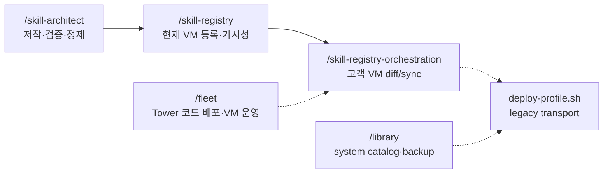

# The Library — Moat System Catalog & Legacy Wrapper

`/library` is no longer the broad skill lifecycle entry point. It remains as a **Moat operator compatibility tool** for the system catalog (`library.yaml`) and external source backup/sync.

For normal skill work, use the role split below.

| Need | Canonical skill |
|---|---|
| Create, validate, audit, or refine a skill body | `/skill-architect` |
| Diagnose current VM visibility/registration or promote a local/customer skill | `/skill-registry` |
| Check/sync customer VM registries across the fleet | `/skill-registry-orchestration` |
| Deploy Tower code / inspect customer VM health | `/fleet` |
| Maintain Moat system `library.yaml` or external source backup | `/library` |

## How It Works

`library.yaml` is the Moat system catalog of references to skills/agents/prompts. Entries define what the operator catalog knows about — not what every VM should install. Customer/company-local skills should live in `local-library.yaml` via `/skill-registry`, not in this system catalog.

- **`LIBRARY_REPO_URL`**: `<your forked repo url>` (set after `/library install`)
- **`LIBRARY_YAML_PATH`**: `~/.claude/skills/library/library.yaml`
- **`LIBRARY_SKILL_DIR`**: `~/.claude/skills/library/`

## Commands

### Moat system catalog maintenance (operator host)

| Command | Cookbook | Purpose |
|---|---|---|
| `/library add <details>` | [add.md](cookbook/add.md) | **Moat system catalog** `library.yaml` 에 항목 추가. Customer/company-local 등록은 `/skill-registry register-local/promote-local` 사용. |
| `/library remove <name>` | [remove.md](cookbook/remove.md) | system catalog 에서 제거. Customer-local catalog 제거가 아님. |
| `/library list` | [list.md](cookbook/list.md) | system catalog 조회. Current VM visibility 진단은 `/skill-registry list/doctor`. |
| `/library search <keyword>` | [search.md](cookbook/search.md) | system catalog 검색. |

### External source sync / backup

| Command | Cookbook | Purpose |
|---|---|---|
| `/library install` | [install.md](cookbook/install.md) | library repo 첫 설정. |
| `/library use <name>` | [use.md](cookbook/use.md) | 외부 source 에서 pull/install/refresh. |
| `/library push <name>` | [push.md](cookbook/push.md) | 로컬 변경 → upstream GitHub 백업. |
| `/library sync` | [sync.md](cookbook/sync.md) | cataloged external source refresh. |

### Legacy customer-VM distribution

| Command | Cookbook | Purpose |
|---|---|---|
| `/library publish <profile\|customer>` | [publish.md](cookbook/publish.md) | **Legacy wrapper.** Canonical flow is `/skill-registry-orchestration diff <customer>` → `/skill-registry-orchestration sync <customer>`. |

**Cookbook 항상 먼저** — `/library <명령>` 실행 시 해당 cookbook 파일 읽고 단계대로 진행.

## Role Handoff



## Host context

- **Operator host (full 프로필, 본 서버)**: `/library` 사용 가능. 단, customer VM sync 는 `/skill-registry-orchestration` 을 우선한다.
- **Managed/standalone customer VM**: `/library` 는 기본 배포 대상이 아니다. customer/company skill 등록은 `/skill-registry` + `local-library.yaml` 로 처리한다.

자세한 customer-custom 보존 정책 + naming 권고: [cookbook/publish.md](cookbook/publish.md).

## Source Format

`library.yaml` 의 `source` 필드:
- `/absolute/path/to/SKILL.md` — local
- `https://github.com/org/repo/blob/main/path/to/SKILL.md` — GitHub browser URL
- `https://raw.githubusercontent.com/org/repo/main/path/to/SKILL.md` — GitHub raw URL

Both GitHub URL formats supported. Auto-detected from prefix.

**Important**: source points to a specific file (SKILL.md, AGENT.md, or prompt file). 항상 parent directory 전체를 pull (필요 파일만 골라 pull 안 함).

### Source Parsing

- **Local paths** (`/`, `~`): 그대로 사용. parent dir 복사.
- **GitHub browser URL** (`/blob/<branch>/<path>`): org/repo/branch/file_path 파싱.
- **GitHub raw URL** (`/raw/<branch>/<path>`): 동일 파싱.

Private repo: SSH 또는 `GITHUB_TOKEN` 사용.

## Typed Dependencies

`requires` 필드:
- `skill:name` — library 의 다른 skill
- `agent:name` — agent
- `prompt:name` — prompt

→ resolve 시 의존성 먼저 (recursive).

## Target Directories

기본 설치 위치 (`default_dirs` 참조):

```yaml
default_dirs:
  skills:
    - default: .claude/skills/
    - global: ~/.claude/skills/
  agents:
    - default: .claude/agents/
    - global: ~/.claude/agents/
  prompts:
    - default: .claude/commands/
    - global: ~/.claude/commands/
```

- "global" 키워드 → `global` dir
- 사용자 명시 → 그 path
- 기본 → `default` dir

## Library Repo Sync (multi-device)

library skill 자체가 cloned git repo (`<LIBRARY_SKILL_DIR>`). `add` 처럼 yaml 변경 시:

1. `git pull` (최신 가져오기)
2. 변경 적용
3. `git add library.yaml && git commit && git push`

→ 카탈로그 multi-device sync 유지.

## Related

- 결정: `~/workspace/decisions/2026-05-01-skill-lifecycle-mandatory-entry-point.md`
- Authoring/refinement: [/skill-architect](../skill-architect/SKILL.md)
- Customer VM 운영: [/fleet](../fleet/SKILL.md)
